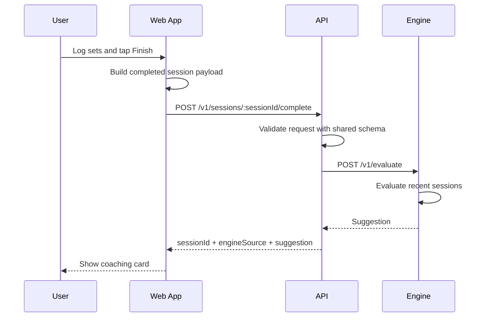
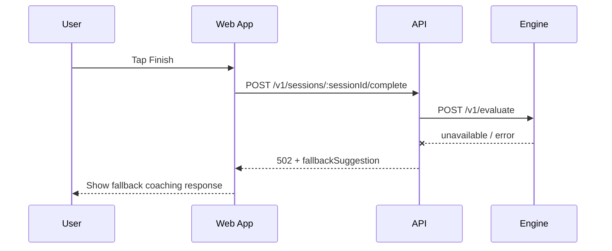
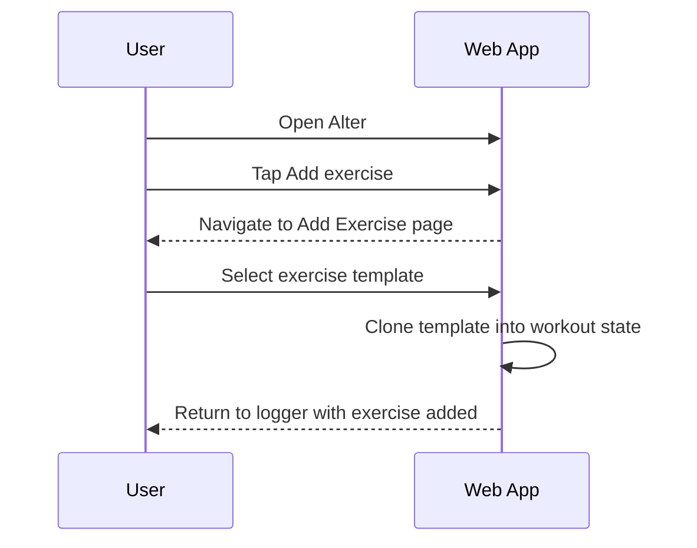
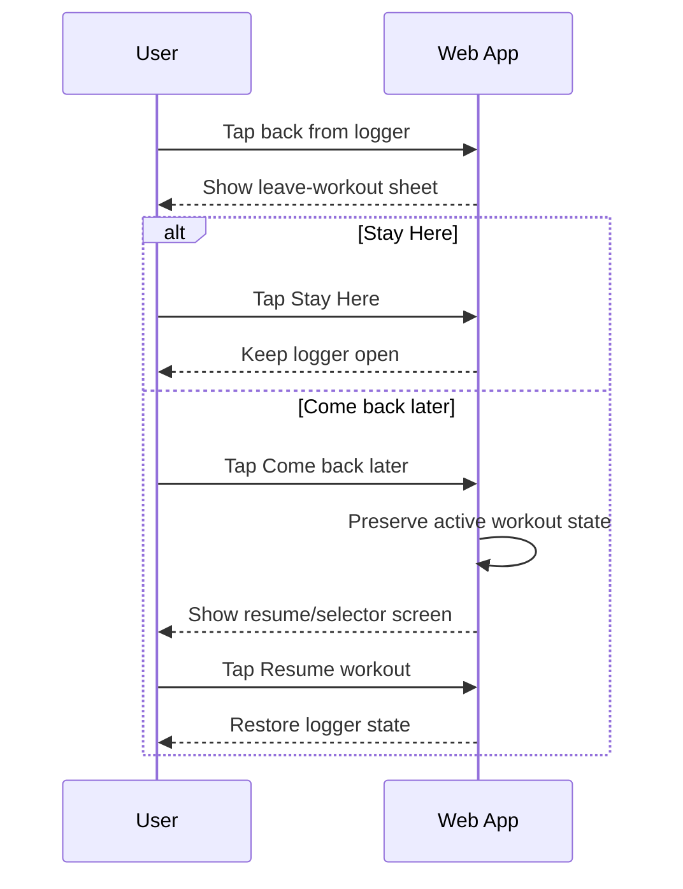
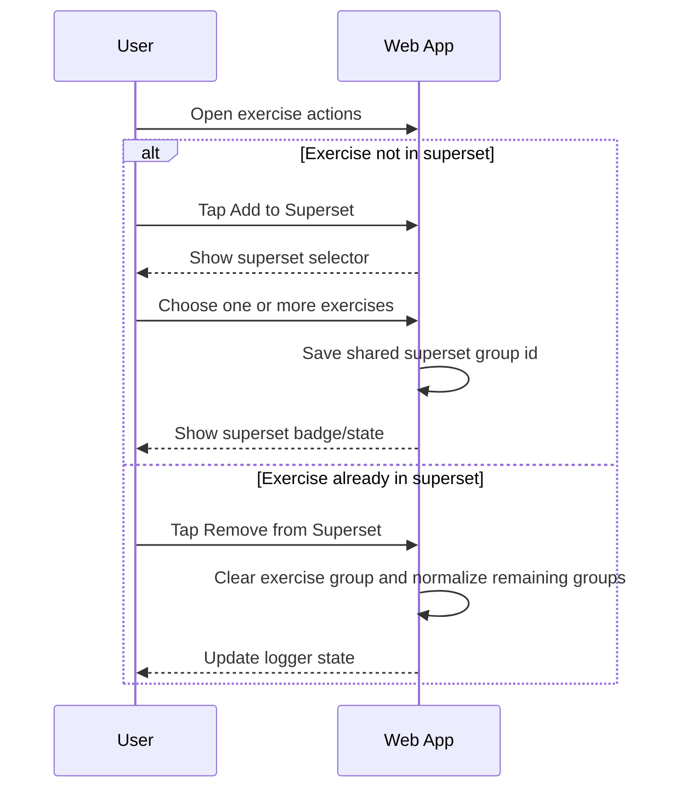
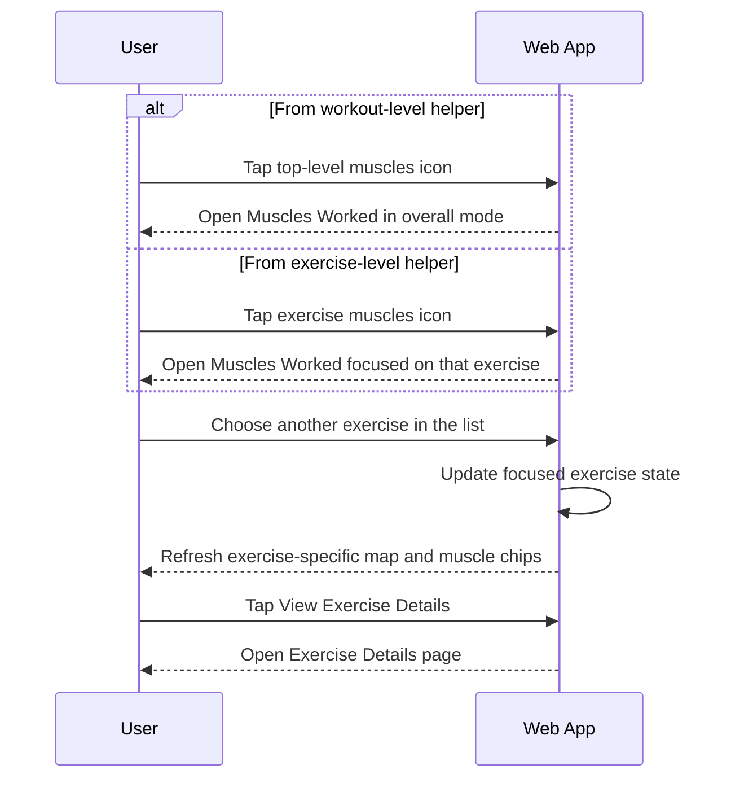

# RepIQ API And Sequence Reference

This is a living engineering reference for the APIs currently in use and the main request/response flows around them.

For implemented decision rules and heuristics, see [algorithms.md](/Users/debeshkuanr/Documents/RepIQ/docs/algorithms.md).

Update this document whenever:

- a new endpoint is added
- a request or response contract changes
- an existing sequence changes meaningfully
- a temporary/demo endpoint is removed or replaced

## Services

- Web app: `apps/web`
- API service: `apps/api`
- Engine service: `apps/engine`
- Shared contracts: `packages/shared`

## Ports Used In Local Development

- Web preview/dev: `4173`
- API: `4000`
- Engine: `8001` during current local testing

## Current Client-Side Workout Flows

These are important current behaviors in the web app even when they do not yet map to backend APIs.

- The app now launches into `Home` rather than directly into the logger
- Planner is now a real client-side surface with:
  - `My Workouts`
  - `Library`
  - `Generate Session`
  - template preview
  - workout builder/edit
- Generated sessions currently follow:
  - generate inputs
  - generated review/builder
  - explicit save or start
- New workout-builder drafts can persist client-side until they are saved
- The active workout timer is client-derived from the workout start time and now updates live while the logger stays open
- Fresh starts now use a precise `startInstant` timestamp so quick sessions and plan starts begin from `0`
- Logger set types currently supported in the client:
  - `warmup`
  - `normal`
  - `drop`
  - `restpause`
  - `failure`
- Exercise reordering is handled through a dedicated reorder sheet rather than separate move-up/move-down actions
- Exercise sections support:
  - per-card collapse / expand
  - collapse-all / expand-all
  - collapsed summaries with logged volume, reward summary, and superset visibility
  - title-led active exercise indication
  - drag-reorder directly from logger exercise headers
- The `Muscles Worked` page is currently a web-only surface with:
  - overall workout mode
  - exercise-focused mode
  - V1 body-map intensity view
  - explicit navigation into exercise details
- Logger reward behavior is currently client-side:
  - set-level rewards are recomputed against historical exercise data plus already-completed same-session sets
  - later same-session sets can replace earlier rewarded sets
  - exercise-level rewards appear only once the exercise result is meaningful
  - session-level reward presentation is intentionally deferred to completion / summary flows
- Guidance behavior is currently client-side:
  - user preference can enable top strip, inline, both, or neither
  - inline guidance opens a centered modal on demand
  - bottom guidance remains the stable fallback surface
- Active workout flow is currently client-side and follows:
  - exercise completion = last set done
  - next active exercise = first exercise in the list whose last set is not done
  - no active exercise when none remain incomplete by that rule
- Rest timing behavior is currently client-side:
  - non-last set completion starts normal rest timer
  - actual last-set completion starts workout-level between-exercises timer
  - sticky full-width bottom timer tray appears only while a timer is active
  - tray can minimize into a timer FAB
  - tray visibility can be hidden/restored at the session level from workout actions
- `Add Exercise` client flow now includes:
  - always-visible search
  - tabbed browsing for all exercises, muscle groups, and exercise types
  - thin quick filters for `In workout` and `Selected`
  - ordered multi-select with fixed bottom add-action bar
  - group expand / collapse for `By Muscle` and `Types`
  - token-based search matching across exercise and muscle text
  - repeated sort selection reverses direction
  - explicit exercise-detail opening from the selector through an info action
  - custom exercise create/edit as a guided 2-step client flow
  - custom exercise library management via detail page actions
- Finish-workout confirmation currently supports:
  - go back and finish
  - finish anyway
  - unfinished rows are ignored when finishing anyway
- Psychological/readiness architecture is currently client-side design/stub work only:
  - documented in `docs/psych-layer.md`
  - not yet exposed as API-backed capture flows

## Shared Contracts

Defined in [packages/shared/src/index.ts](/Users/debeshkuanr/Documents/RepIQ/packages/shared/src/index.ts).

### Main Shared Schemas In Use

- `exerciseEvaluationRequestSchema`
- `coachingSuggestionSchema`
- `exerciseHistorySessionSchema`
- `workoutSetSchema`

### Exercise Evaluation Request

Used by:
- web app when completing a session
- API when validating session-complete input
- API when calling engine `/v1/evaluate`

Shape:

```json
{
  "goal": "hypertrophy",
  "exercise_name": "Bench Press",
  "sessions": [
    {
      "date": "2026-01-19",
      "exercise": "Bench Press",
      "session_key": "bench-week-3",
      "sets": [
        {
          "weight": 80,
          "reps": 12,
          "set_type": "normal",
          "rpe": 8,
          "failed": false
        }
      ]
    }
  ]
}
```

Field notes:
- `goal`: currently `strength | hypertrophy | endurance | powerbuilding`
- `exercise_name`: human-readable exercise name
- `sessions`: ordered by date in the engine after validation

### Coaching Suggestion Response

Used by:
- engine as primary evaluation output
- API response to session-complete flow
- web coaching card rendering

Shape:

```json
{
  "suggestion_type": "INCREASE_LOAD",
  "reason_code": "TOP_OF_RANGE",
  "label": "Progress the weight",
  "what": "Add 2.5kg and target 6-8 reps next session.",
  "why": "You have been consistently at the top of your hypertrophy rep range across recent sessions.",
  "certainty": "high",
  "evidence": [
    {
      "key": "average_reps",
      "label": "Average reps",
      "value": "11.3",
      "detail": "Rep performance is consistent enough to justify a progression jump."
    }
  ],
  "coaching_note": "This is a progression signal, not a guess.",
  "override_allowed": true,
  "override_prompt": "If this does not match how the session felt, you can override it and keep training ownership.",
  "safety_notes": [],
  "generated_for_date": "2026-01-19",
  "options": [],
  "rep_range_context": {
    "average_reps": 11.3,
    "rep_min": 6,
    "rep_max": 12,
    "status": "progressing"
  }
}
```

## API Service Endpoints

Defined in [apps/api/src/index.ts](/Users/debeshkuanr/Documents/RepIQ/apps/api/src/index.ts).

Base URL in local development:
- `http://127.0.0.1:4000`

Default headers:
- `Content-Type: application/json` for POST routes

### `GET /health`

Used for:
- API liveness checks
- local boot verification

Used in:
- manual testing
- local environment sanity-checking

Request:
- no body
- no special headers required

Response `200`:

```json
{
  "status": "ok",
  "service": "api",
  "timestamp": "2026-04-06T00:00:00.000Z"
}
```

### `GET /v1/architecture`

Used for:
- lightweight debug/introspection
- showing current north-star and coaching-contract intent

Used in:
- manual architecture inspection only for now

Request:
- no body
- no special headers required

Response `200`:

```json
{
  "northStar": "You've been putting in the work. RepIQ makes sure the work pays off.",
  "firstSlice": [
    "Generate program",
    "Log session",
    "Persist sets",
    "Run engine",
    "Show next suggestion"
  ],
  "coachingContract": {
    "principle": "RepIQ should guide with evidence and clear uncertainty, not just issue instructions.",
    "responseShape": {}
  }
}
```

### `POST /v1/programs/generate`

Used for:
- program-generation entry point

Used in:
- planned onboarding/program generation flow
- not yet wired into the current web app

Headers:
- `Content-Type: application/json`

Request body:

```json
{
  "goal": "hypertrophy",
  "daysPerWeek": 4,
  "equipment": ["barbell", "bench", "dumbbell"],
  "experienceLevel": "intermediate",
  "sessionDurationMinutes": 60
}
```

Request field rules:
- `goal`: `strength | hypertrophy | general_fitness`
- `daysPerWeek`: integer `2..6`
- `equipment`: non-empty array
- `experienceLevel`: `beginner | returning | intermediate | advanced`
- `sessionDurationMinutes`: integer `30..120`

Success response `202`:

```json
{
  "status": "accepted",
  "message": "Program generation should become an async workflow backed by Supabase and the explanation worker.",
  "payload": {
    "goal": "hypertrophy",
    "daysPerWeek": 4,
    "equipment": ["barbell", "bench", "dumbbell"],
    "experienceLevel": "intermediate",
    "sessionDurationMinutes": 60
  }
}
```

Validation failure `400`:

```json
{
  "error": "Invalid program generation payload",
  "issues": []
}
```

### `POST /v1/sessions/:sessionId/complete`

Used for:
- main logger completion flow
- getting next-step coaching suggestion after a completed session

Used in:
- current web logger `Finish` action

Headers:
- `Content-Type: application/json`

Path params:
- `sessionId`: current client/workout session identifier

Request body:
- `ExerciseEvaluationRequest`

Example request:

```json
{
  "goal": "hypertrophy",
  "exercise_name": "Bench Press",
  "sessions": [
    {
      "date": "2026-01-05",
      "exercise": "Bench Press",
      "sets": [
        { "weight": 80, "reps": 10, "set_type": "normal", "rpe": 7.5, "failed": false }
      ]
    },
    {
      "date": "2026-01-12",
      "exercise": "Bench Press",
      "sets": [
        { "weight": 80, "reps": 11, "set_type": "normal", "rpe": 8, "failed": false }
      ]
    },
    {
      "date": "2026-01-19",
      "exercise": "Bench Press",
      "sets": [
        { "weight": 80, "reps": 12, "set_type": "normal", "rpe": 8, "failed": false }
      ]
    }
  ]
}
```

Special current behavior:
- if body is empty, the API falls back to an internal demo payload

Success response `200`:

```json
{
  "status": "ok",
  "sessionId": "bench-session-001",
  "engineSource": "live",
  "suggestion": {}
}
```

Validation failure `400`:

```json
{
  "error": "Invalid session completion payload",
  "issues": []
}
```

### `GET /v1/media/config`

Used for:
- client-side media capability checks
- image/video limits for finish-workout flows
- discovering the active storage target

Used in:
- upcoming finish-workout media persistence work
- future native/mobile client handshake

Response `200`:

```json
{
  "status": "ok",
  "uploadDir": "apps/api/uploads",
  "constraints": {
    "target": "local_uploads",
    "max_images_per_workout": 3,
    "image_enabled": true,
    "video_enabled": false,
    "max_photo_mb": 10,
    "max_video_mb": 100,
    "max_video_seconds": 30
  }
}
```

Notes:
- `uploadDir` is the intended backend-managed local beta target
- clients should treat the API as the storage owner rather than writing directly to disk

### `POST /v1/media/prepare`

Used for:
- reserving a backend-managed media asset id
- returning a stable storage key before upload
- keeping the client contract stable across local uploads and future cloud storage

Used in:
- planned finish-workout image persistence
- future mobile client media uploads

Headers:
- `Content-Type: application/json`

Request body:

```json
{
  "kind": "image",
  "file_name": "progress-front.jpg",
  "mime_type": "image/jpeg",
  "byte_size": 2400180,
  "workout_id": "workout-2026-04-09-upper-push"
}
```

Success response `200`:

```json
{
  "status": "ready",
  "target": "local_uploads",
  "asset": {
    "id": "media_a12b34c5",
    "kind": "image",
    "storage_key": "workouts/2026-04-09/media_a12b34c5.jpg",
    "original_name": "progress-front.jpg",
    "mime_type": "image/jpeg",
    "byte_size": 2400180,
    "upload_url": null,
    "public_url": null
  },
  "constraints": {
    "target": "local_uploads",
    "max_images_per_workout": 3,
    "image_enabled": true,
    "video_enabled": false,
    "max_photo_mb": 10,
    "max_video_mb": 100,
    "max_video_seconds": 30
  }
}
```

Validation failure `400`:

```json
{
  "error": "Invalid media prepare payload",
  "issues": []
}
```

Engine failure / fallback `502`:

```json
{
  "status": "error",
  "sessionId": "bench-session-001",
  "engineSource": "unavailable",
  "message": "The engine could not be reached.",
  "fallbackSuggestion": {}
}
```

### `GET /v1/demo/session-complete`

Used for:
- manual demo/testing of the coaching flow

Used in:
- manual testing only

Request:
- no body
- no special headers required

Success response `200`:

```json
{
  "status": "ok",
  "engineSource": "live",
  "sessionId": "demo-session-bench-001",
  "suggestion": {}
}
```

Fallback response `502`:

```json
{
  "status": "error",
  "engineSource": "unavailable",
  "sessionId": "demo-session-bench-001",
  "message": "The engine could not be reached.",
  "fallbackSuggestion": {}
}
```

## Engine Service Endpoints

Defined in [apps/engine/app/main.py](/Users/debeshkuanr/Documents/RepIQ/apps/engine/app/main.py) and [apps/engine/app/models.py](/Users/debeshkuanr/Documents/RepIQ/apps/engine/app/models.py).

Base URL in local development:
- `http://127.0.0.1:8001`

Default headers:
- `Content-Type: application/json` for POST routes

### `GET /health`

Used for:
- engine liveness checks

Used in:
- local boot verification

Response `200`:

```json
{
  "status": "ok",
  "service": "engine"
}
```

### `POST /v1/evaluate`

Used for:
- next-step coaching decision for a single exercise history

Used in:
- API session-complete endpoint
- direct engine testing

Headers:
- `Content-Type: application/json`

Request body:
- `ExerciseEvaluationRequest`

Example request:

```json
{
  "goal": "hypertrophy",
  "exercise_name": "Bench Press",
  "sessions": [
    {
      "date": "2026-01-05",
      "exercise": "Bench Press",
      "sets": [
        { "weight": 80, "reps": 10, "set_type": "normal", "rpe": 7.5, "failed": false }
      ]
    }
  ]
}
```

Success response `200`:
- `Suggestion`

Special behavior:
- if `sessions` is empty, engine returns a low-certainty `BUILDING` response rather than hard-failing

### `POST /v1/history/analyze`

Used for:
- broader longitudinal history analysis
- badges, training pattern analysis, and exercise-level analysis

Used in:
- engine-side history analysis work
- not yet wired to the current web app

Headers:
- `Content-Type: application/json`

Request body:

```json
{
  "goal": "hypertrophy",
  "user_context": {
    "name": "",
    "gender": null,
    "age": null,
    "experience": null,
    "recovery": null,
    "stress": null
  },
  "exercises": {
    "Bench Press": [
      {
        "date": "2026-01-19",
        "exercise": "Bench Press",
        "sets": [
          { "weight": 80, "reps": 12, "set_type": "normal", "rpe": 8, "failed": false }
        ]
      }
    ]
  }
}
```

Success response `200`:

```json
{
  "goal": "hypertrophy",
  "frequency_recommendation": {},
  "training_pattern": {},
  "badges": [],
  "exercises": []
}
```

## Current Main Sequences

### Session Complete Coaching Flow



### Session Complete Fallback Flow



### Add Exercise Flow



### Leave And Resume Workout Flow



### Superset Flow



### Muscles Worked Flow



## Current Gaps

- Program generation endpoint is still placeholder-only
- No persistent auth/database-backed API flows yet
- No workout-plan CRUD API yet
- No custom-exercise API yet
- Add-exercise and logger flows are still local-state driven in the web app
- Muscles Worked remains a client-only page; there is no backend muscle-map or exercise-detail content API yet

## Next API Surfaces Likely To Be Added

- exercise selector/search endpoint or local indexed catalog strategy
- custom exercise create/update endpoint
- workout plans list/detail/create/update endpoints
- session persistence endpoints backed by Supabase
- override capture endpoint for coaching decisions
