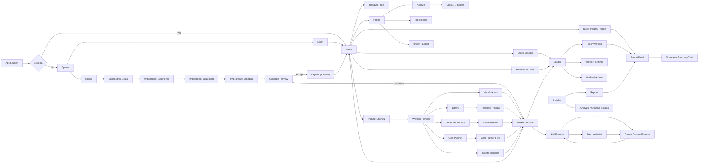

# Navigation Map

This document is the current source of truth for app-level navigation, page connectivity, entry/exit points, and bottom-nav visibility.

It is intentionally product-facing:

- what each page is for
- how users reach it
- where it should lead next
- whether it should show persistent navigation

## Navigation Principles

- Bottom navigation is reserved for high-frequency destinations only.
- Focused task flows should hide bottom navigation.
- `Profile` is important but not frequent enough for bottom-nav placement.
- `Ready to Train` belongs inside `Home`, not as a separate top-level destination.
- `Finish Workout` should always connect into a report/review path.
- `Generate Workout` should stop at review/builder before entering the logger.
- `Goal Planner` powers both in-app plan creation and the new user onboarding flow — same UI, different entry points and exit targets.
- `Onboarding` must deliver a generated plan before the user reaches `Home` for the first time. The value proposition is that the app feels personal on day one.
- `Auth` gates the entire app. No navigation outside the auth layer until session exists.
- `Progress Photos` live inside `Insights` (Progress tab) — they are a form of self-tracking, not a social feature by default.
- `Community` is built in full but surfaced from `Home` and `Profile` initially — not a bottom-nav slot until the feature has density. It is designed to be promoted to bottom nav once warranted.
- `Leaderboards` live inside `Community`, scoped to friends / groups / global. They never appear in `Insights` (which is personal) or `Home` (which is motivating, not competitive by default).

## Top-Level Destinations

### Bottom navigation (current)

- `Home`
- `Planner`
- `Insights`

### Bottom navigation (future — when Community has traction)

- `Home`
- `Planner`
- `Insights`
- `Community`

### Non-bottom-nav app destinations

- `Profile`
  - reached from `Home` top-right avatar
- `Community`
  - reached from `Home` card or `Profile` until it earns a bottom-nav slot
- `Onboarding`
  - reached once, immediately after `Signup`
- `Paywall`
  - reached from `Onboarding` (end of free trial prompt) or from feature gates inside the app

## Connectivity Map

```mermaid
flowchart TD
    ENTRY["App Launch"] --> AUTH_CHECK{"Has session?"}
    AUTH_CHECK -- Yes --> A["Home"]
    AUTH_CHECK -- No --> SP["Splash / Landing"]

    SP --> LG_AUTH["Login"]
    SP --> SG["Signup"]

    LG_AUTH --> A
    SG --> OB["Onboarding"]
    OB --> PW_OB["Paywall (optional)"]
    PW_OB --> A
    OB --> A

    A["Home"] --> B["Workout Planner"]
    A --> C["Active Logger"]
    A --> D["Insights"]
    A --> E["Profile"]

    B --> B1["My Workouts"]
    B --> B2["Library"]
    B --> B3["Generate Workout"]
    B --> B4["Goal Planner"]
    B --> B5["Workout Builder"]

    B1 --> B5
    B2 --> B5
    B3 --> B5
    B4 --> B5
    B5 --> C

    C --> F["Finish Workout"]
    F --> G["Workout Report"]
    G --> D
    G --> H["Shareable Summary Card"]

    D --> D1["Analyzer / Insights"]
    D --> D2["Reports"]
    D2 --> H

    E --> E1["Preferences"]
    E --> E2["Account"]
    E --> E3["Import / Export"]
    E2 --> LG_OUT["Logout → Splash"]

    PW_GATE["Paywall (feature gate)"] --> A
    E --> PW_GATE
```



## Detailed Flow Map



## Page Inventory

### Auth layer

| Page | Entry points | Exit points | Bottom nav |
|---|---|---|---|
| `Splash / Landing` | app cold start (no session) | `Login`, `Signup` | hidden |
| `Login` | `Splash` | `Home`, `Signup`, `Forgot Password` | hidden |
| `Signup` | `Splash`, `Login` | `Onboarding` | hidden |
| `Forgot Password` | `Login` | `Login` | hidden |

### Onboarding flow

> Onboarding runs once, immediately after `Signup`. It shares the same goal-collection and generation UI as `Goal Planner` in the Planner subtree. The only differences are the entry source and the final exit (→ `Home` instead of → `Workout Builder`).

| Page | Entry points | Exit points | Bottom nav |
|---|---|---|---|
| `Onboarding: Goals` | `Signup` completion | next step | hidden |
| `Onboarding: Experience` | previous step | next step | hidden |
| `Onboarding: Equipment` | previous step | next step | hidden |
| `Onboarding: Schedule` | previous step | next step | hidden |
| `Onboarding: Generate Preview` | previous step | `Paywall`, `Workout Builder`, `Home` | hidden |
| `Paywall / Subscription` | `Onboarding` end, `Account`, feature gates | `Home`, back to source | hidden |

### App-level pages

| Page | Parent | Entry points | Exit points | Bottom nav |
|---|---|---|---|---|
| `Home` | app root | app launch (authed), bottom nav | `Planner`, `Insights`, `Profile`, `Logger`, `Report Detail` | shown |
| `Workout Planner` | app root | bottom nav, `Home` shortcut | `My Workouts`, `Library`, `Generate Workout`, `Goal Planner`, `Workout Builder` | shown |
| `Insights` | app root | bottom nav, `Home`, `Finish Workout` | `Analyzer`, `Reports`, `Report Detail`, `Share Card` | shown |
| `Profile` | `Home` | top-right avatar/settings on `Home` | `Preferences`, `Account`, `Import / Export`, back to `Home` | hidden |

### Home subtree

| Page | Parent | Entry points | Exit points | Bottom nav |
|---|---|---|---|---|
| `Ready to Train` section | `Home` | default `Home` content | `Logger`, `Planner` | n/a |
| `Quick Session` | `Home` | quick action on `Home` | `Logger` | hidden |
| `Resume Workout` | `Home` | active workout card | `Logger` | hidden |
| `Latest Insight / Report card` | `Home` | `Home` content | `Report Detail` | hidden |

### Planner subtree

| Page | Parent | Entry points | Exit points | Bottom nav |
|---|---|---|---|---|
| `My Workouts` | `Workout Planner` | planner tab | `Workout Builder`, `Logger` | shown |
| `Library` | `Workout Planner` | planner tab | `Template Preview`, `Workout Builder` | shown |
| `Template Preview` | `Library` | template card | `Workout Builder`, back to `Library` | hidden |
| `Generate Workout` | `Workout Planner` | planner action | `Generated Review`, back to `Planner` | hidden |
| `Generated Review` | `Generate Workout` | after generation | `Workout Builder`, `My Workouts`, `Logger` | hidden |
| `Goal Planner` | `Workout Planner` | planner action | `Goal Planner Flow`, back to `Planner` | hidden |
| `Goal Planner Flow` | `Goal Planner` | planner action | `Workout Builder`, back to `Planner` | hidden |
| `Create Template` | `Workout Planner` | planner `+` action | `Workout Builder` | hidden |
| `Workout Builder / Edit` | planner flows | `My Workouts`, `Library`, `Generate`, `Goal Planner`, `Create Template` | `Planner`, `Add Exercise`, `Logger` | hidden |
| `Add Exercise` | `Workout Builder` | add-exercise action | `Workout Builder`, `Create Custom Exercise`, `Exercise Detail` | hidden |
| `Create / Edit Custom Exercise` | `Add Exercise` or `Exercise Detail` | create/edit action | `Add Exercise`, `Exercise Detail` | hidden |
| `Exercise Detail` | `Add Exercise`, `Workout Builder` | info tap, name tap | `Add Exercise`, `Create / Edit Custom Exercise`, back to `Workout Builder` | hidden |

### Logger subtree

| Page | Parent | Entry points | Exit points | Bottom nav |
|---|---|---|---|---|
| `Active Logger` | workout start surfaces | `Home`, `My Workouts`, `Generated Review`, `Workout Builder`, `Quick Session`, `Resume Workout` | `Workout Settings`, `Workout Actions`, `Finish Workout` | hidden |
| `Workout Settings` | `Active Logger` | top settings icon | back to `Logger` | hidden |
| `Workout Actions` | `Active Logger` | alter/actions sheet | back to `Logger`, discard to `Home` or `Planner` depending on source | hidden |
| `Finish Workout` | `Logger` | finish action | `Workout Report`, back to `Logger` | hidden |

### Insights subtree

Insights has three tabs: **Reports**, **Analyzer**, **Progress**.

| Page | Parent | Entry points | Exit points | Bottom nav |
|---|---|---|---|---|
| `Analyzer / Ongoing Insights` | `Insights` | insights landing/tab | `Report Detail`, back to `Insights` | shown |
| `Reports` | `Insights` | insights landing/tab | `Report Detail`, `Share Card` | shown |
| `Workout Report / Report Detail` | `Insights` or `Finish Workout` | report list, post-finish flow | `Insights`, `Share Card` | hidden |
| `Shareable Summary Card` | `Report Detail` | share action | back to `Report Detail` | hidden |
| `Progress` tab | `Insights` | insights landing/tab | `Progress Photo Detail`, `Add Progress Photo` | shown |
| `Progress Photo Detail` | `Progress` tab | photo tap | `Report Detail` (for linked session), back to `Progress` | hidden |
| `Add Progress Photo` | `Progress` tab, `Finish Workout` prompt | add-photo action | back to `Progress` or `Finish Workout` flow | hidden |
| `Photo Compare` | `Progress` tab | compare action on any photo | back to `Progress` | hidden |

### Community subtree

Community is a top-level destination reached from `Home` (card) and `Profile` until it earns a bottom-nav slot.

| Page | Parent | Entry points | Exit points | Bottom nav |
|---|---|---|---|---|
| `Community Home` | app root | `Home` card, `Profile`, bottom nav (future) | `My Groups`, `Friends`, `Leaderboard` | hidden (shown when in bottom nav) |
| `My Groups` | `Community Home` | community landing | `Group Detail`, `Create Group` | — |
| `Group Detail` | `My Groups` | group card | `Group Leaderboard`, `Member Activity Feed`, `Member List`, `Create Challenge` | hidden |
| `Group Leaderboard` | `Group Detail` | leaderboard tab | `Friend Profile`, back to `Group Detail` | hidden |
| `Member Activity Feed` | `Group Detail` | activity tab | `Report Detail`, `Progress Photo Detail`, back to `Group Detail` | hidden |
| `Member List` | `Group Detail` | members tab | `Friend Profile`, back to `Group Detail` | hidden |
| `Create Group` | `My Groups` | create action | `Group Detail`, back to `My Groups` | hidden |
| `Friends` | `Community Home` | community landing | `Find Friends`, `Pending Requests`, `Friend Profile` | hidden |
| `Find Friends` | `Friends` | search action | `Friend Profile`, back to `Friends` | hidden |
| `Friend Profile` | `Friends`, `Member List`, `Leaderboard` | friend tap | `Report Detail` (their shared), back to source | hidden |
| `Leaderboard` | `Community Home` | community landing | `Friend Profile`, filter controls | hidden |
| `Global Leaderboard` | `Leaderboard` | filter: Global | `Friend Profile` | hidden |

### Profile subtree

| Page | Parent | Entry points | Exit points | Bottom nav |
|---|---|---|---|---|
| `Preferences` | `Profile` | profile list | back to `Profile` | hidden |
| `Account` | `Profile` | profile list | `Paywall`, `Logout` → `Splash`, back to `Profile` | hidden |
| `Import / Export` | `Profile` | profile list | back to `Profile` | hidden |

## Bottom Navigation Rules

### Show bottom nav on

- `Home`
- `Workout Planner`
- `Insights`

### Hide bottom nav on

- All `Auth` pages (`Splash`, `Login`, `Signup`, `Forgot Password`)
- All `Onboarding` steps
- `Paywall`
- `Logger`
- `Workout Builder`
- `Add Exercise`
- `Create / Edit Custom Exercise`
- `Template Preview`
- `Generate Workout`
- `Generated Review`
- `Goal Planner`
- `Goal Planner Flow`
- `Finish Workout`
- `Report Detail`
- `Shareable Summary Card`
- `Profile`
- `Preferences`
- `Account`
- `Import / Export`

## Route Intent Summary

- `Splash` — brand moment; confident, spare; routes to auth
- `Login / Signup` — establish session; minimal friction
- `Onboarding` — the value proposition delivered in person; makes the app feel personal before the user logs a single rep
- `Paywall` — an upgrade offer, never a wall; always has a free path through
- `Home` — momentum and motivation; shows the user their own progress reflected back at them; every visit should feel like a reason to train
- `Planner` — create, browse, generate, organise, and prepare
- `Logger` — perform the active session; nothing else
- `Finish Workout` — close, review, and save; feeds into the reward and report loop
- `Insights` — understand trends; the payoff for consistency
- `Profile` — configure and manage account/data

## Home Design Notes

Home is the **most-visited surface** in the product. Every return visit is an opportunity to either pull the user into a session or lose them to inertia. The goal is to make opening the app feel like a small reward in itself.

### Emotional job

The user opens the app at 7am before the gym, or at 9pm wondering if they should go tomorrow, or after a 5-day gap feeling guilty. Home needs to meet all three states:

- **Ready** → clear CTA to the next session, no friction
- **Undecided** → show their streak, their recent win, make them feel the cost of skipping
- **Lapsed** → no shame, just a quiet "welcome back" and an easy re-entry point

### Content hierarchy (top to bottom)

1. **Contextual greeting + streak** — time-aware ("Good morning"), streak visible ("🔥 4 days"), personalised subline based on last session timing
2. **Primary CTA** — context-aware: "Continue Push Day A →" (if plan exists) / "Start a session →" (if no active plan) / "You're on a rest day — review your week →" (if they trained yesterday)
3. **This week snapshot** — sessions completed vs target, volume trend vs last week; a single number or bar that makes progress feel tangible
4. **Last workout card** — name, date, duration, sets; tappable → Report Detail
5. **Recent PR highlight** — if a record was broken in the last session, surface it here; the reminder of a win is the best reason to come back
6. **Planner shortcut** — browse / edit plans; lower priority, always present

### Rules

- Home should never show an empty state after the first session. Once there's data, there's always something to show.
- The primary CTA label should change every visit based on context — never static "Quick Workout."
- Streak is shown always, even if it's 0 — "0 days — start your streak today" is motivating, not punishing.
- No feature promotion on Home. No "Try Generate Workout!" banners. Home is for the user's own story, not the product's.

## Onboarding Design Notes

Onboarding is the **most important first-impression surface** in the product. It must do two things simultaneously: collect the signal needed to personalise the experience, and make the user feel excited about what's coming. It is not a form. It is the beginning of a relationship.

### Emotional arc

The user arrives with a mix of motivation and skepticism. They've downloaded apps before. They've started plans before. They may have quit before. The onboarding must acknowledge that energy and meet it with confidence — not hype, but quiet conviction that *this time will be different because this is built for them*.

```
Arrive with hope/skepticism
  → Feel seen (step 1 asks why, not what)
  → Feel understood (the app reflects their answers back)
  → Feel anticipation (something is being built for them)
  → Feel the reveal (their plan exists, it has their name on it)
  → Feel momentum (first session is one tap away)
```

### Core design rules

1. **Never feel like a form.** Large tap targets, one question at a time, animated transitions between steps.
2. **Reflect choices back immediately.** As they answer, the UI shows their profile forming — "Intermediate lifter · Full gym · 4 days/week · Building strength."
3. **Copy matches their emotion.** If they said "I've been inconsistent" on step 1, the schedule step says "Consistency beats intensity — pick a number you'll actually stick to." Not generic.
4. **Progress is spatial, not numerical.** No "Step 3 of 5". Instead, a growing bar or a set of dots that fill in — progress that *feels* like something is being assembled.
5. **The generate step is a ritual.** A loading moment that feels intentional, not like waiting. Show the plan being built — exercise names appearing one by one, the week filling in.
6. **The reveal is a wow moment.** The plan has a name. It has a structure. It feels like it was made by someone who knows them. This is the product's first promise fulfilled.

### Step design

| Step | Headline | Sub-copy | Options |
|---|---|---|---|
| Why you're here | "What finally made you open this?" | No judgment. Just tell us where you're starting from. | I want to stop being inconsistent · I've hit a plateau · I want to look and feel stronger · I'm starting fresh · I just want to feel good |
| Goals | "What are we building toward?" | We'll shape your plan around this. | Muscle & strength · Fat loss · Endurance · General fitness |
| Experience | "How much do we build on?" | This shapes the structure, not the difficulty. | Just starting out · Some experience · I know what I'm doing |
| Equipment | "What's your arena?" | We'll work with what you have. | Full gym · Home setup · Just me (bodyweight) |
| Schedule | "How much time can you commit?" | Pick something real. Consistency beats intensity. | 2 days · 3 days · 4 days · 5 days |
| Generate | "Building your plan…" | Live build animation — exercises appearing, days filling in. | (no choices — just watch it form) |
| Reveal | "Your [Goal] Plan is ready." | Here's week one. [Plan name] · [X] exercises · [X] weeks | Start today → · Customise → |

### The reveal moment

The reveal screen is the emotional peak of onboarding. Design it with care:

- **Name the plan** after their goal: "Your Strength Foundation", "4-Day Fat Loss Plan", "3-Day Full Body Start"
- **Show week 1** as a visual schedule — days of the week with session names
- **One highlighted stat** that speaks to their why: "Built for progressive overload over 8 weeks" / "Designed for consistency, not burnout"
- **Primary CTA: "Start today →"** — goes directly into Session 1 of the plan
- **Secondary CTA: "Customise"** — goes to Workout Builder (for high-intent users who want control)
- **Tertiary: "Save and explore first"** — goes to Home (for browsers who aren't ready to commit)

### Shared UI with Goal Planner

The in-app `Goal Planner` (Planner → Goal Planner Flow) uses the same step UI and generation logic as onboarding. The router passes a `returnTarget` to control post-completion routing:

| Context | `returnTarget` | Post-generate destination |
|---|---|---|
| Onboarding | `"onboarding-complete"` | Reveal screen → Paywall (if applicable) → Home |
| In-app Goal Planner | `"builder"` | Reveal screen → Workout Builder |

This means the Goal Planner inside the app also gets the same motivating reveal moment — it's not just for new users.

### Skip / defer

Always offer a "Skip for now" on steps 2–5 (not step 1 — the emotional opener is too important to skip). Users who skip land on Home with a prominent incomplete-onboarding card: *"Finish setting up your plan →"*

### Splash / Landing screen

Before Login/Signup, the splash screen has one job: make the person want to be here. Not a feature list. Not a screenshot carousel.

A single strong visual, a single line, and two buttons:

> **"Train smarter. Every session."**
> [Get started — it's free]  ·  [I already have an account]

The splash is a brand moment. Keep it confident and spare.

## Progress Photos Design Notes

Progress photos are the most personal and emotionally resonant data in the product. The goal is to make the user *want* to take one after every session — not because they're prompted to, but because seeing 30 photos side by side across 6 months is genuinely powerful.

### Timeline view

- Vertical scroll, most recent first
- Each entry is the photo at full card width
- Superimposed at the bottom of the photo: date chip + session name + 2–3 key stats (e.g. "Bench 80kg · 18 sets · 52 min")
- The overlay is semi-transparent, dark gradient from bottom — never obscures the photo
- Tap → full-screen lightbox with full session detail accessible by scrolling up from the photo

### Compare mode

- Select any two dates from the timeline
- Side-by-side layout, same overlay treatment
- A single stat diff line between them: "↑ 8 kg total volume · ↑ 3 sessions/week over this period"
- No body measurement overlays unless the user has entered measurements — never prompt for weight in the photo flow

### Add photo prompt

- Appears at the end of `Finish Workout` flow, after the Report screen: *"Add a progress photo for today?"* — soft prompt, easy to dismiss, never mandatory
- Also always accessible from the Progress tab directly
- Camera opens to front-facing by default (most progress photos are selfies)
- Photos are stored locally and optionally backed up — never shared without explicit user action

### Privacy

- Progress photos are **private by default, always**
- Sharing a progress photo requires an explicit tap: "Share to [Group]" or "Include in Summary Card"
- No progress photos are visible to Community members unless the user chooses to share them individually

---

## Community & Social Design Notes

Community is a **retention and accountability layer**, not a social network. The distinction matters for design: users are not here to post, they're here to train. Social features should push them toward training harder and coming back more often — not toward creating content.

### Core loop

```
Train → Finish → Results auto-posted to your groups (opt-out per group)
                 → Friends see your session in their activity feed
                 → You appear on the leaderboard
                 → Someone reacts → you get a notification → you open the app
```

The notification is the hook. "Sarah just overtook you on the weekly leaderboard" is a more powerful re-engagement than any push notification copy.

### Groups

Groups are the primary social container. A group has:
- A name and optional focus (e.g. "PPL Bros", "Morning Crew", "90-Day Cut Challenge")
- Members (invite-only or link-join)
- A shared leaderboard (weekly by default)
- An activity feed (recent workouts from members, opt-in)
- Optional: a **Challenge** — a time-boxed goal (e.g. "Most sessions in October") with a clear end date and winner

Groups are low-pressure. There's no public wall, no comments on posts, no likes. Reactions are a single emoji per session (🔥 is enough). Keep the social surface minimal — depth of interaction kills casual users.

### Leaderboard design

The leaderboard is only motivating if the user can realistically win or compete. Design for this:

| Metric | Reset cadence | Why |
|---|---|---|
| Streak | Weekly (Sun–Sat) | Weekly reset means everyone starts equal; no legacy advantage |
| Sessions this week | Weekly | Simple, honest, achievable |
| Volume this month | Monthly | Rewards intensity, not just frequency |
| PRs this month | Monthly | Levels the playing field — a beginner's first 60kg squat counts |
| Improvement % | Monthly | Relative gain; a beginner improving 15% beats a veteran improving 2% |

**Global leaderboard** exists but is deprioritised in UI — it's demotivating unless you're elite. Friends and group leaderboards are always the default view.

### Friend Profile

A friend's profile shows only what they've chosen to share:
- Current streak
- Sessions this week/month
- Recent shared workouts (name, date, duration — no exercise detail unless they share it)
- Shared progress photos (only if they've shared them to a mutual group)

No follower counts. No public profiles by default. RepIQ is a training app, not a fitness influencer platform.

### Sharing model

| Content | Default privacy | Can share to |
|---|---|---|
| Workout completion (name + stats) | Auto-shared to opted-in groups | Groups, Friends |
| Workout Report (full detail) | Private | Friends, Specific group, Public link |
| Progress Photo | Private | Friends, Specific group |
| Shareable Summary Card | Anyone with link | Groups, public |
| PR achievement | Auto-shared to opted-in groups | Groups, Friends |

---

## Connectivity Rules To Preserve

- `Quick Session` always opens a fresh logger session.
- `Resume Workout` always returns to the active logger state.
- `Generate Workout` should always stop at review/builder before workout start.
- `Goal Planner` should remain under `Planner`, not become a separate top-level destination.
- `Finish Workout` should always feed a report/review path.
- `Shareable Summary Card` should be reachable both after finishing a workout and from saved reports.
- `Profile` should stay reachable from `Home`, not consume a bottom-nav slot unless usage proves otherwise.
- `Onboarding` must only run once per account. A `hasCompletedOnboarding` flag gates it.
- `Logout` always clears session and routes to `Splash`, never to `Home`.
- `Paywall` should never be a dead end — always offer a "Continue with free plan" or "Start trial" exit.
- `Progress Photos` are private by default, always. Never shared without an explicit user action.
- `Community` is surfaced from `Home` and `Profile` until it has enough density to earn a bottom-nav slot.
- `Leaderboards` always default to Friends or Group scope, never Global.
- `Group activity feed` is opt-out per group, not opt-in — the default is to participate, but leaving is frictionless.
- `Progress Photo Compare` never auto-suggests body composition comparisons — just show the photos, let the user draw their own conclusions.

---

## V2+ — Psychological Layer

> **Status: planned, not yet built.**
> The data model must be designed for this in V1 even if the intelligence isn't shipped until V2. Psychological signals that aren't captured in V1 cannot be retrospectively reconstructed.

### What this is

A lightweight layer of psychological and subjective data that sits alongside training data and unlocks a qualitatively smarter coaching experience. Not therapy. Not journaling. A coach asking "how are you doing?" in the right moment — brief, optional, clearly connected to helping you train better.

### V1 capture points (seed the data model now)

These are the only three psychological signals collected in V1. All optional. All contextually placed. Total friction per session: under 10 seconds.

| When | What | UI |
|---|---|---|
| Onboarding Step 1 | Emotional "why" — what brought them here | Single-choice card (already planned) |
| Finish Workout (after Report) | Post-session mood + perceived energy | Two 5-point emoji scales, one tap each |
| Home daily card (max once/day) | Pre-training readiness — sleep quality, stress, energy | Three 3-point icon selectors, dismissible in one tap |

The daily Home card only appears if the user has at least one logged workout. It disappears the moment they tap into a session. It never blocks navigation.

### Psychological dimensions tracked

| Dimension | Capture method | V2 use |
|---|---|---|
| Emotional motivation ("why") | Onboarding + optional re-check every 90 days | Shapes copy tone, notification language, goal framing |
| Post-workout mood | Finish Workout emoji scale | Detect overtraining, burnout, session quality trends |
| Perceived energy | Finish Workout emoji scale | Correlate with plan intensity, rest day triggers |
| Pre-session readiness | Home daily card | Suggest modified sessions on low-readiness days |
| Sleep quality | Home daily card | Factor into deload recommendations, plateau detection |
| Stress level | Home daily card | Skip prediction, session length suggestions |
| Motivation style | Derived from adherence patterns | Personalise notification cadence and copy |
| Consistency pattern | Derived from session timestamps | Identify best training windows, skip-risk days |

### V2 intelligence surfaces

None of these exist in V1, but the data collected above feeds all of them:

**Adaptive plan adjustment**
- Plan intensity auto-modulates based on rolling 7-day readiness average
- Rest days can be suggested (not forced) when readiness signals are persistently low
- "You've been rating energy low on Mondays — want to move your heavy day to Wednesday?"

**Skip prediction + proactive intervention**
- Pattern: "You skipped 3 of your last 4 Thursday sessions"
- Trigger: low stress + low energy ratings on those days
- Action: on the next Thursday morning, surface a 15-min low-effort alternative on Home

**Deload detection**
- Training load is high + post-workout mood is trending down + perceived energy is declining = deload recommendation
- Never mandatory, always framed as listening to the body

**Motivation drift detection**
- If the gap between stated goal (onboarding) and actual behaviour widens over 4+ weeks, surface a gentle goal re-check: *"You said you wanted to get stronger. Your last 3 sessions were lighter than usual — still the right goal?"*

**Personality-aware coaching language**
Based on the onboarding emotional "why" + adherence pattern, the app learns the user's motivation style:

| Style | Signal | Adapted behaviour |
|---|---|---|
| Accountability-driven | Skips hurt them emotionally, strong streak behaviour | Emphasise streak, notify on near-misses |
| Achievement-driven | Responds to PRs, volume milestones | Highlight records, progressive overload progress |
| Social-driven | More active after community interactions | Surface group activity before their usual session time |
| Intrinsic / self-driven | Consistent without social signals, high autonomy preference | Minimal notifications, data-rich Insights |
| Irregular / lapsed | Long gaps, emotional re-starts | Gentle re-entry, no shame framing, short sessions |

### Navigation implications for V2

No new top-level pages are needed. The psychological layer is surfaced through existing pages:

- **Home** — readiness card, context-aware CTA copy, skip-risk nudges
- **Insights → Analyzer** — psychological trend overlay on training graphs (mood line over volume bars, readiness over consistency)
- **Finish Workout** — mood/energy capture after the Report, before the session is fully closed
- **Plan generation (Goal Planner + Generate)** — readiness data factors into suggested intensity and session length
- **Notifications** — copy is personalised to motivation style; cadence is personalised to adherence pattern
- **Profile → Preferences** — user can view and clear their psychological data; opt out of any capture dimension

### Data and privacy principles

- All psychological data is **personal and private**. It is never shared, not even in anonymised aggregate without explicit consent.
- The user can view exactly what has been captured: Profile → Preferences → My Data
- Any dimension can be turned off independently — turning off mood capture doesn't affect energy capture
- If the user deletes their account, psychological data is destroyed immediately, not archived
- The system **never tells the user what their psychological profile says about them** — it only acts on it silently to improve their experience. The exception: explicit Insights surfaces where the user opts in to see their own patterns.
